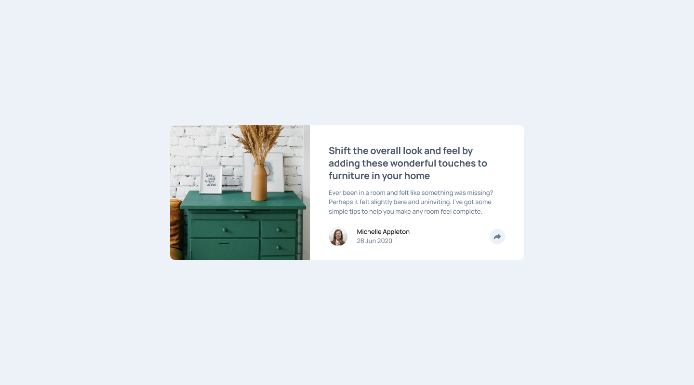
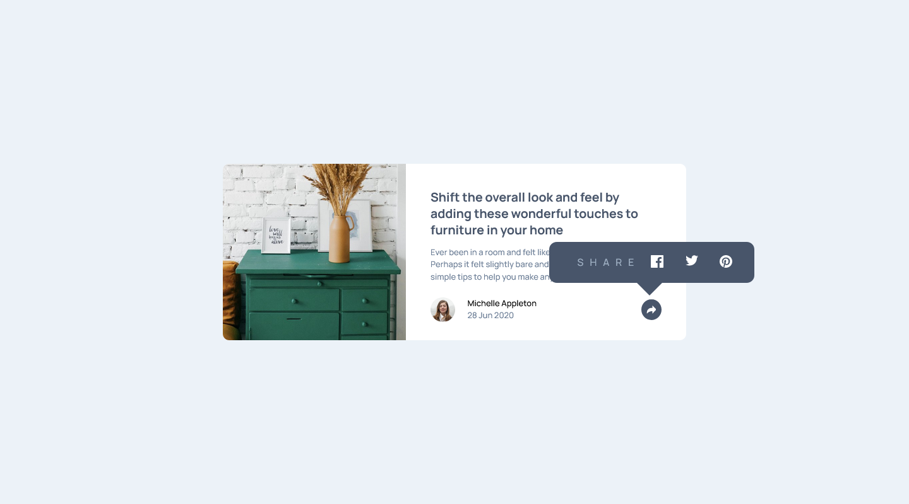
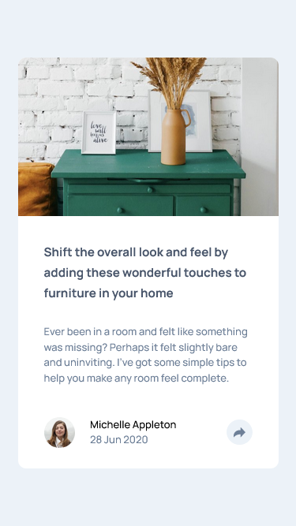
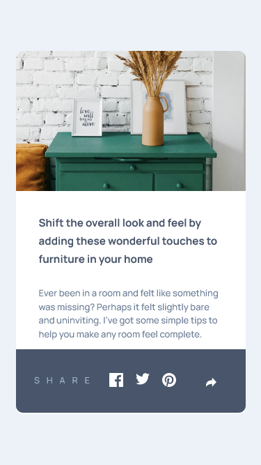

# Frontend Mentor - Article preview component

Solution for [Article preview component]().

### Demo

**Desktop view**

**Desktop active state**

**Mobile View**

**Mobile active state**

#

### Links

- Solution URL: [Source code]()
- Live Site URL: [Article preview component]()

## Built with

- Semantic HTML5 markup
- CSS custom properties
- Flexbox
- Mobile-first workflow

#

## Useful resources

- [Netlify](https://app.netlify.com/) - You can host your static websites for free.
- [Perfect Pixel](https://chrome.google.com/webstore/detail/perfectpixel-by-welldonec/dkaagdgjmgdmbnecmcefdhjekcoceebi?hl=en) - This is really useful for comparing the results and adjusting the final output according to the design.

## Author

- Github - [Mubeen](https://github.com/MubeenAhmadShaikh/)
- Frontend Mentor - [@MubeenAhmadShaikh](https://www.frontendmentor.io/profile/MubeenAhmadShaikh)
- Twitter - [@imMubeen\_](https://www.twitter.com/imMubeen_)

## Acknowledgments

Thanks to frontendmentor community.
