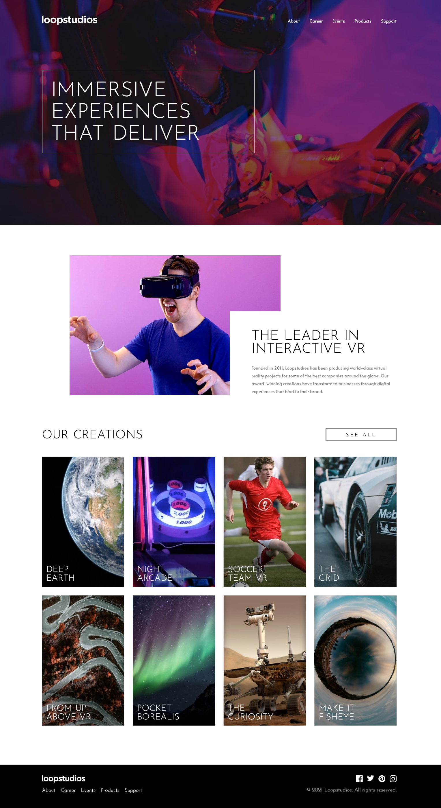
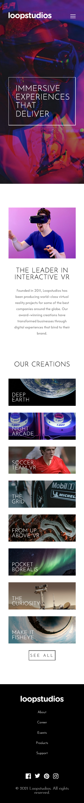
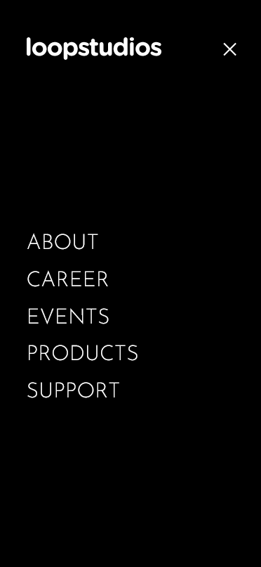

# Frontend Mentor - Loopstudios landing page solution

This is a solution to the [Loopstudios landing page challenge on Frontend Mentor](https://frontendmentor-loopstudios-landing-page-main.netlify.app/).

## Overview

This one was challenging it took more time to make it responsive while having that absolute positions but it was a good learning.

### Demo

**Desktop View**

**Mobile View**

**Menu**

#

### Links

- Frontendmentor Solution URL: [Challenge solution](https://www.frontendmentor.io/solutions/loopstudio-landing-page-AdZDya1Kl)
- Live Site URL: [Loopstudios landing page](https://frontendmentor-loopstudios-landing-page-main.netlify.app/)
- Challenge Link : [Loopstudios landing page](https://www.frontendmentor.io/challenges/loopstudios-landing-page-N88J5Onjw)
- Source code : [Github](https://github.com/MubeenAhmadShaikh/FrontendMentorChallenges/tree/main/loopstudios-landing-page-main)

## My process

### Built with

- Semantic HTML5 markup
- CSS custom properties
- Flexbox
- Mobile-first workflow
- Javascript

#

### Useful resources

- [Flexbox](https://css-tricks.com/snippets/css/a-guide-to-flexbox/) - This helped me for better understanding on flexbox and its all the propereties. I really liked this and will refer it going forward.

## Author

- Github - [Mubeen](https://github.com/MubeenAhmadShaikh/)
- Frontend Mentor - [@MubeenAhmadShaikh](https://www.frontendmentor.io/profile/MubeenAhmadShaikh)
- Twitter - [@imMubeen\_](https://www.twitter.com/imMubeen_)
