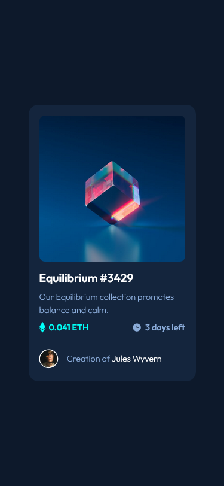

# Frontend Mentor - NFT preview card component

This is a solution to the [NFT preview card component challenge on Frontend Mentor](https://frontendmentor-nft-preview-card-component-main.netlify.app/).
## Table of contents

- [Overview](#overview)
  - [The challenge](#the-challenge)
  - [Demo](#screenshot)
  - [Links](#links)
- [The process](#my-process)
  - [Built with](#built-with)
  - [What I learned](#what-i-learned)
  - [Useful resources](#useful-resources)
- [Author](#author)

## Overview
Created this easy NFT card with just HTML5 and CSS3.

### Demo

**Desktop View**

**Mobile View**

**Menu**

#

### Links

- Solution URL: [Source code](https://github.com/MubeenAhmadShaikh/FrontendMentorChallenges/tree/main/nft-preview-card-component-main)
- Live Site URL: [NFT preview card component](https://frontendmentor-nft-preview-card-component-main.netlify.app/)

## The process

### Built with

- Semantic HTML5 markup
- Simple CSS styles

### What I learned

- **Positioning**
- **Changing another class styles on hover**

#

### Useful resources

- [Hover Effects](https://www.w3schools.com/howto/howto_css_image_overlay.asp) - This helped me for better understanding for hover effects and how we can add overlay on hover. I really liked this and will refer it going forward.

## Author

- Github - [Mubeen](https://github.com/MubeenAhmadShaikh/)
- Frontend Mentor - [@MubeenAhmadShaikh](https://www.frontendmentor.io/profile/MubeenAhmadShaikh)
- Twitter - [@imMubeen_](https://www.twitter.com/imMubeen_)
