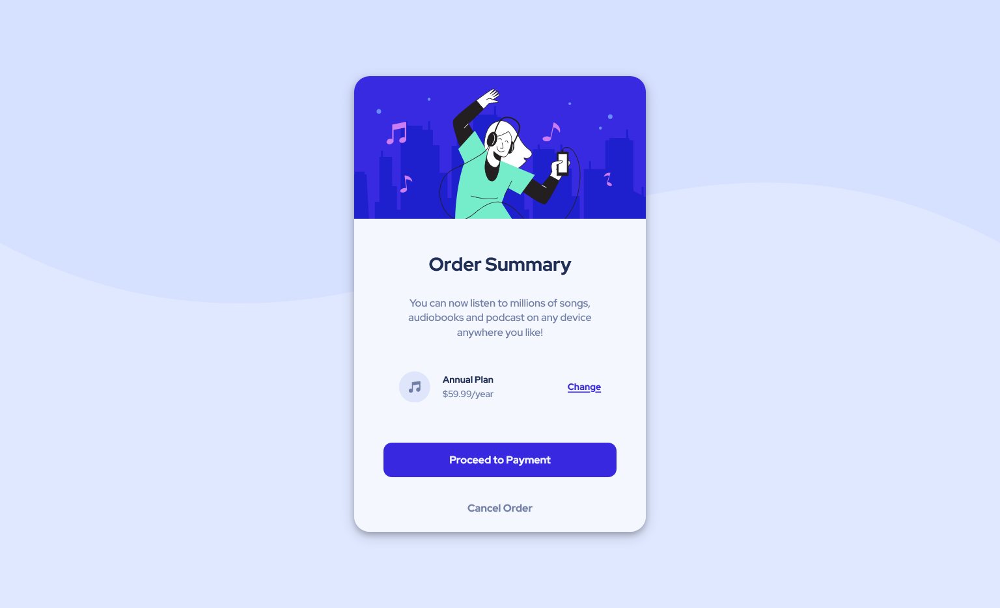
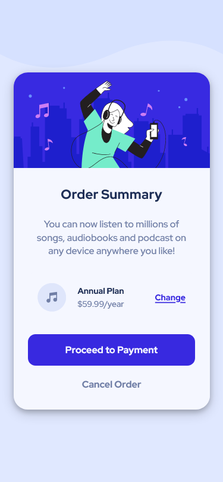

# Frontend Mentor - Order summary component main

Solution for [Order summary component main]().

### Demo

**Desktop View**

**Mobile View**

#

### Links

- Solution URL: [Source code]()
- Live Site URL: [Stats preview card component]()

## Built with

- Semantic HTML5 markup
- CSS custom properties
- Flexbox
- Mobile-first workflow

## What I learned

- SVG image formatting
- box-shadow

#

## Useful resources

- [Flexbox](https://css-tricks.com/snippets/css/a-guide-to-flexbox/) - This helped me for better understanding on flexbox and its all the propereties. I really liked this and will refer it going forward.
- [Box-shadow](https://www.w3schools.com/css/css3_shadows_box.asp) -This website has simplest explaination on this.
- [Perfect Pixel](https://chrome.google.com/webstore/detail/perfectpixel-by-welldonec/dkaagdgjmgdmbnecmcefdhjekcoceebi?hl=en) - This is really useful for comparing the results and adjusting the final output according to the design.

## Author

- Github - [Mubeen](https://github.com/MubeenAhmadShaikh/)
- Frontend Mentor - [@MubeenAhmadShaikh](https://www.frontendmentor.io/profile/MubeenAhmadShaikh)
- Twitter - [@imMubeen\_](https://www.twitter.com/imMubeen_)

## Acknowledgments

Thanks to frontendmentor community.
