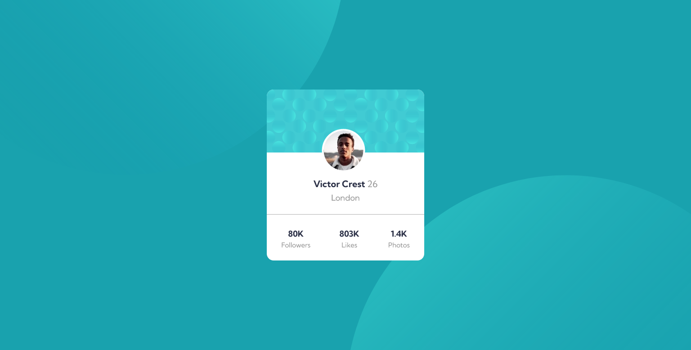
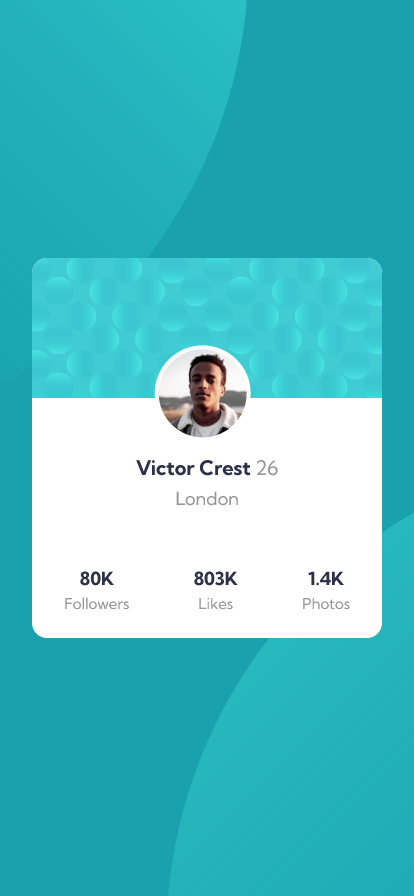

# Frontend Mentor - Profile card component main

Solution for [Profile card component main](https://frontendmentor-challenge-profile-card-component-main.netlify.app/).

### Demo

**Desktop View**

**Mobile View**

#

### Links

- Solution URL: [Source code](https://github.com/MubeenAhmadShaikh/FrontendMentorChallenges/tree/main/profile-card-component-main)
- Live Site URL: [Profile card component main](https://frontendmentor-challenge-profile-card-component-main.netlify.app/)

## Built with

- Semantic HTML5 markup
- CSS custom properties
- Flexbox
- Mobile-first workflow

## What I learned

- SVG image formatting
- Positioning

#

## Useful resources

- [Netlify](https://app.netlify.com/) - You can host your static websites for free.
- [Background Position](https://www.w3schools.com/cssref/playdemo.asp?filename=playcss_background-size) - This is the best demonstration I saw for positions.
- [Perfect Pixel](https://chrome.google.com/webstore/detail/perfectpixel-by-welldonec/dkaagdgjmgdmbnecmcefdhjekcoceebi?hl=en) - This is really useful for comparing the results and adjusting the final output according to the design.

## Author

- Github - [Mubeen](https://github.com/MubeenAhmadShaikh/)
- Frontend Mentor - [@MubeenAhmadShaikh](https://www.frontendmentor.io/profile/MubeenAhmadShaikh)
- Twitter - [@imMubeen\_](https://www.twitter.com/imMubeen_)

## Acknowledgments

Thanks to frontendmentor community.
