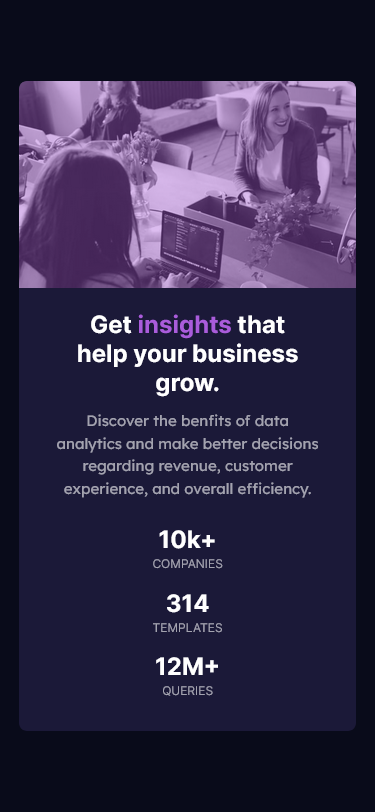

# Frontend Mentor - Stats preview card component

Solution for [Stats preview card component](https://frontendmentor-sunnyside-agency-landing-page.netlify.app/).

### Demo

**Desktop View**

**Mobile View**

#

### Links

- Solution URL: [Source code](https://github.com/MubeenAhmadShaikh/FrontendMentorChallenges/tree/main/sunnyside-agency-landing-page)
- Live Site URL: [Stats preview card component](https://frontendmentor-sunnyside-agency-landing-page.netlify.app/)

## Built with

- Semantic HTML5 markup
- CSS custom properties
- Flexbox
- Mobile-first workflow

## What I learned

Tried implementing both flex and grid to use for proper layouts.

#

## Useful resources

- [Flexbox](https://css-tricks.com/snippets/css/a-guide-to-flexbox/) - This helped me for better understanding on flexbox and its all the propereties. I really liked this and will refer it going forward.
- [CSS Grid](https://learncssgrid.com/) - This is a greate website for beginners to learn the Grid which helped me finally understand the layouts, spacing and how we can use it for responsive website. I'd recommend it to anyone still learning this concept.
- [Perfect Pixel](https://chrome.google.com/webstore/detail/perfectpixel-by-welldonec/dkaagdgjmgdmbnecmcefdhjekcoceebi?hl=en) - This is really useful for comparing the results and adjusting the final output according to the design.

## Author

- Github - [Mubeen](https://github.com/MubeenAhmadShaikh/)
- Frontend Mentor - [@MubeenAhmadShaikh](https://www.frontendmentor.io/profile/MubeenAhmadShaikh)
- Twitter - [@imMubeen\_](https://www.twitter.com/imMubeen_)

## Acknowledgments

Thanks to frontendmentor community. Got to know about the perfect pixel so tried comparing the results.
