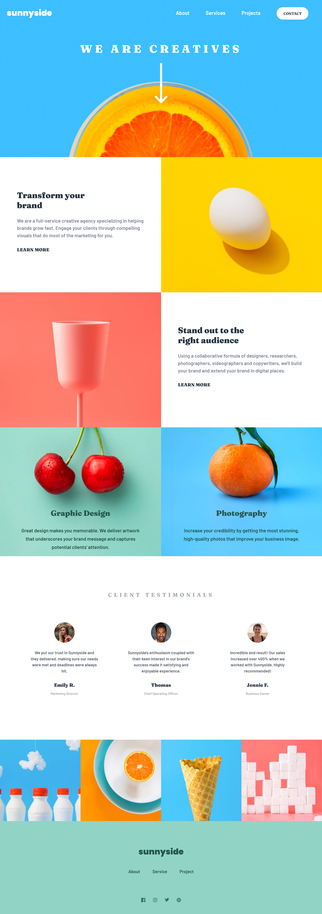
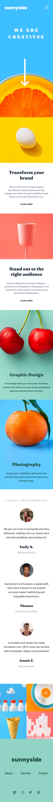
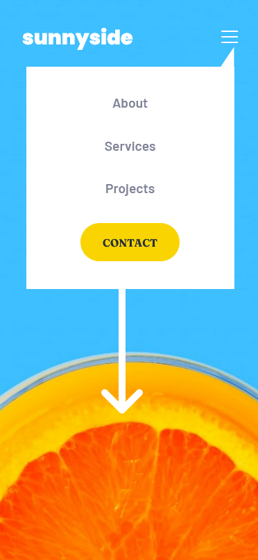

# Frontend Mentor - Sunnyside agency landing page solution

This is a solution to the [Sunnyside agency landing page challenge on Frontend Mentor](https://frontendmentor-sunnyside-agency-landing-page.netlify.app/).

## Table of contents

- [Overview](#overview)
  - [The challenge](#the-challenge)
  - [Demo](#screenshot)
  - [Links](#links)
- [The process](#my-process)
  - [Built with](#built-with)
  - [What I learned](#what-i-learned)
  - [Continued development](#continued-development)
  - [Useful resources](#useful-resources)
- [Author](#author)

## Overview

Created this cool landing page with just HTML5, CSS3 and two lines of Javascript. It is a pretty good design to start with for the understanding of CSS Grid, Flex and responsive mobile first website.

### Demo

**Desktop View**



**Mobile View**



**Menu**



#

### Links

- Solution URL: [Source code](https://github.com/MubeenAhmadShaikh/FrontendMentorChallenges/tree/main/sunnyside-agency-landing-page)
- Live Site URL: [Sunnyside landing page](https://frontendmentor-sunnyside-agency-landing-page.netlify.app/)

## My process

### Built with

- Semantic HTML5 markup
- CSS custom properties
- Flexbox
- CSS Grid
- Mobile-first workflow
- Javascript

### What I learned

- **How to use Grids for complex layouts**
- **How to build mobo-first website**
- **How to use predefined variables for constant styles**
- **Pseudo-classes**

#

**Following are the most useful and challenging code snippets where I learned the most**

To see how you can add code snippets, see below:

```html
<!-- Content -->
<section class="content"></section>
<!--  Content -->
```

This easy two lines of code made that menu bar working very smoothly on mobile devices.

```js
document.querySelector("#menu").addEventListener("click", function () {
  document.querySelector(".menu").classList.toggle("hidden");
});
```

### Continued development

Going forward will always start with mobile first website to build. Planning to use more easy solution then writing the same styles again and again. And definitely going to use more grid for complex layouts.

### Useful resources

- [Flexbox](https://css-tricks.com/snippets/css/a-guide-to-flexbox/) - This helped me for better understanding on flexbox and its all the propereties. I really liked this and will refer it going forward.
- [CSS Grid](https://learncssgrid.com/) - This is a greate website for beginners to learn the Grid which helped me finally understand the layouts, spacing and how we can use it for responsive website. I'd recommend it to anyone still learning this concept.

## Author

- Github - [Mubeen](https://github.com/MubeenAhmadShaikh/)
- Frontend Mentor - [@MubeenAhmadShaikh](https://www.frontendmentor.io/profile/MubeenAhmadShaikh)
- Twitter - [@imMubeen\_](https://www.twitter.com/imMubeen_)
