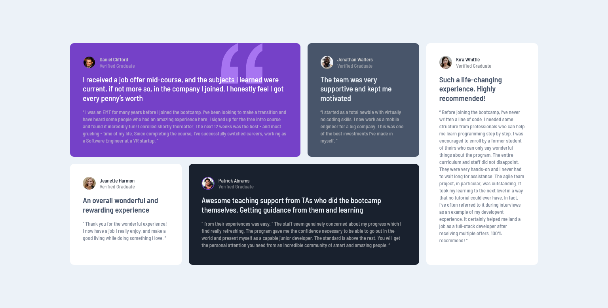

<h1 align="center"> Testimonials Grid Section</h1>

This is a solution to the [Testimonials Grid Section challenge on Frontend Mentor]().

## Overview

Best challenge on frontendmentor for beginners for learning and using grid and making it responsive for all the screen.

### Demo

**Desktop View**



**Mobile View**


#

### Links

- Solution URL: [Source code]()
- Live Site URL: [Testimonials Grid Section]()
- Challenge URL: [Frontendmentor Challenge]()
- Frontendmentor.io solution link URL: [Frontendmentor Challenge Solution]()

### Built with

- Semantic HTML5 markup
- CSS custom properties
- CSS Grid
- Mobile-first workflow

### What I learned

- **How to use Grids for complex layouts**
- **How to build mobo-first website**
- **How to use predefined variables for constant styles**
- **How to use different and other shorthand properties of grid css**

#

**Following are the most useful and challenging code snippets where I learned the most**

The grid-template-area and grid-area properties:

```css
.wrapper {
  grid-template-columns: repeat(3, 1fr);
  grid-template-rows: repeat(3, 1fr);
  grid-template-areas:
    "item-1 item-1 item-2"
    "item-3 item-3 item-3"
    "item-5 item-4 item-4";
}
```

### Continued development

Definitely going to use the grid shorthand properties going forward it really makes it really easy and understandable.

### Useful resources

- [Grid with examples](https://gridbyexample.com/examples/) - Best example/guide for anyone creating complex grid layouts or testimonials/gallery. It really helped me understanding with examples and make the code also optimize.

## Author

- Github - [Mubeen](https://github.com/MubeenAhmadShaikh/)
- Frontend Mentor - [@MubeenAhmadShaikh](https://www.frontendmentor.io/profile/MubeenAhmadShaikh)
- Twitter - [@imMubeen\_](https://www.twitter.com/imMubeen_)
